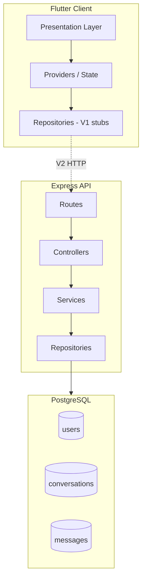

# Aegis Nexus — Architecture (V1)

## Vision

Aegis Nexus is a **single intelligent interface** over multiple AI providers. V1 establishes boundaries so providers, billing, and enterprise policies can be added without rewrites.

## High-level diagram



## Why Clean Architecture

| Principle | Application |
|-----------|-------------|
| Dependency rule | UI depends on domain abstractions, not SQL or HTTP details |
| Testability | Services and repositories can be unit-tested in isolation |
| Replaceability | Swap `AuthRepositoryStub` for `AuthRepositoryApi` in V2 |
| Team scale | Features (`auth`, `chat`, `settings`) own their folders |

## Frontend layers

```
features/<name>/
  domain/models/       # Pure Dart entities
  data/                # API / local persistence
  presentation/
    providers/         # ChangeNotifier (V1)
    widgets/
    *_screen.dart
```

**go_router** `ShellRoute` keeps the sidebar mounted while child routes change — better UX than rebuilding layout per screen.

**Provider** is used for V1 simplicity; Riverpod or Bloc can replace it without moving widgets.

## Backend layers

```
modules/<name>/
  *.routes.js      # HTTP verbs and paths
  *.controller.js  # req/res mapping
  *.service.js     # Business rules
  *.repository.js  # SQL
```

Shared **middleware** (`authenticate`, `errorHandler`) avoids duplicating JWT and error shapes.

## Authentication flow (structure)

1. `POST /auth/register` — bcrypt hash, insert user, return JWT
2. `POST /auth/login` — verify hash, return JWT
3. Protected routes — `Authorization: Bearer <token>`
4. Flutter V1 uses `AuthRepositoryStub`; V2 stores token securely (`flutter_secure_storage`)

## Chat flow (structure)

1. Client creates conversation → `POST /chat/conversations`
2. User message → `POST /chat/conversations/:id/messages` with `role: user`
3. V2: AI Router service consumes message, calls provider, stores `role: assistant`

## AI Router (placeholder)

`ai-router.service.js` documents future responsibilities:

- Provider registry and health
- Routing policy (cost, latency, capability)
- Normalized request/response schema

Returns `501` until providers are configured — explicit failure vs silent no-op.

## Security notes for production

- Rotate `JWT_SECRET` and use HTTPS
- Rate-limit auth endpoints
- Validate and sanitize all message `metadata` JSON
- Row-level ownership checks (all chat queries include `user_id`)

## Mobile and web

Flutter single codebase:

- **Web**: `flutter run -d chrome`
- **Desktop**: Windows/macOS/Linux runners included
- **Mobile**: Android/iOS runners included

Responsive breakpoints in `ShellScreen` (900px) align sidebar behavior with enterprise dashboards.
